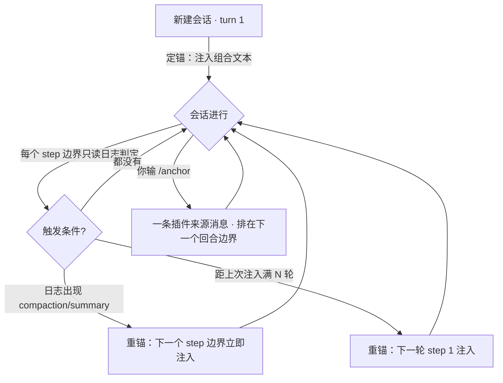

<div align="center">

# 定锚 · Anchor

**为 DeepSeek Harness 会话注入一段可自由组合的指令，并在压缩或长会话后自动重锚同一段原文。**

人设、口吻、工作纪律、项目规范——开场说一次，之后永远算数。

[](https://www.npmjs.com/package/@yeastcloud/dsh-anchor)
[](https://www.npmjs.com/package/@yeastcloud/dsh-anchor)
[](https://github.com/yeastcloud/dsh-anchor/actions/workflows/ci.yml)
[](LICENSE)
[](#安装)

[English](README.en.md) · [更新日志](CHANGELOG.md) · [问题反馈](https://github.com/yeastcloud/dsh-anchor/issues)

</div>

---

## 它解决什么问题

你在会话开头写下一段"人设 / 规则"——用中文回答、先给结论、危险操作要先问、代码只给最小可运行版本。前几轮它很好用。然后：

- **第 40 轮**：那段话已经沉在上下文最深处，模型开始忘；
- **一次 `/compact` 之后**：它被摘要吞掉，彻底消失——而摘要不会替你复述"你要求先给结论"；
- **长工具链里**：几十条工具结果把它越推越远，风格和纪律一起漂走。

`dsh-anchor` 就是给这段指令**打一口锚**：开场注入一次，之后每当会话被压缩、或跨过你设定的轮数，就把**同一段原文**重新锚回去。

> 名字取自航海：锚不是缆绳，不能拖着船走；它只做一件事——**让船别漂**。这条插件也只做一件事。

## 特性

| 特性 | 说明 |
| --- | --- |
| 🧩 **多预设自由组合** | 预设库随便建（最多 100 条），勾选任意几条，按你排的顺序拼成一段指令注入。 |
| ⚓ **压缩后自动重锚** | 检测到 `compaction/summary`（自动压力压缩或 `/compact`）后，在**下一个 step 边界**（可能是回合中途）立刻重锚，下一次模型请求就带着它。 |
| 🔁 **按轮数自动重锚** | 距上次注入满 N 轮（默认 20，可调，0 关闭）后，在下一轮开始时重锚一次。 |
| 🎯 **重锚来源可选** | 「定锚原文」= 永远重复会话开头那段；「最近一条」= 重复本插件最近一次注入（例如你随后用 `/anchor` 定的那条，等于会话内换人设）。 |
| 🧠 **无状态决策** | 触发判定**只读会话日志**，是纯函数；重启、续聊、日志回放都得到同样的结论，同一次触发天然不会重复。 |
| 🚦 **上限护卫** | 单条上限（编辑限长）与合并上限（注入门禁）都在设置页可改，默认 8000 字；超上限**拒绝注入并写日志**，绝不静默截断你的字。 |
| ⚓ **`/anchor` 命令** | 输入 `/anchor` 立即把当前组合**定锚进本会话**：命令在本地执行，**不花 token、不开新回合、不延长正在跑的回合**（锚排在下一个回合边界生效）。`/anchor status` 只看状态不注入。 |
| 🎛 **自带设置页** | 预设库（分页、多选、固定「不注入」行）、注入顺序（拖拽 / ↑↓ 排序、合并预览）、重锚策略 —— 全是可视化操作，不用改配置文件。 |
| 🔒 **绝不外传** | 纯本地插件：不联网、不埋点、不写任何远端；设置只落在你自己的 `~/.dsh/settings.yaml`。 |

## 安装

```sh
# 需要 DeepSeek Harness（Web profile）
dsh plugin --profile web add @yeastcloud/dsh-anchor

# 重启 profile 后生效（Host 半只在启动时加载）
dsh web
```

装好后打开 **设置 → 定锚**：

1. 「＋ 新增预设」写几段你要长期生效的指令（人设、纪律、项目规范各一条都行）；
2. 勾选它们，在下方**注入顺序**里拖成你想要的拼接顺序；
3. 新建一个会话——第一条指令就是这样进来的。

**环境要求**：Node `^22.19 || >=24`；DeepSeek Harness 0.1.5 线（`0.1.5-rc.2` 起验证）。插件含 Host 半（注入逻辑）与 Client 半（设置页）。

## 命令

在任意会话里输入 `/anchor`：

| 命令 | 做什么 |
| --- | --- |
| `/anchor` | 把当前组合**定锚进本会话**：注入一条插件来源的消息，在**下一个回合边界**生效（不唤醒驱动，也**不会延长正在跑的回合**），此后该会话的压缩/轮数重锚都复用它。命令处理器在接收它的 agent 上本地执行，所以**不花 token、不产生模型回复**。 |
| `/anchor status` | 只读报告：总开关、组合与字数、重锚来源与轮数间隔、本会话的注入历史（首条 / 最近一条各自的 seq 与字数，以及排队中还没落地的那条）与距上次注入过了几轮。**不注入任何内容。** |

被拒绝的情形都会明确报错，而不是"差不多地注入"：总开关关闭、组合为空（「不注入」）、合并字数超上限。

> 为什么把它做成命令：命令契约明确写着 handler 在 agent 上本地执行、**不把命令发给模型**——所以它能做到"零副作用地改上下文"，这正是"给会话打锚"该有的样子。也正因为如此，早先那个挂在输入框旁的「发组合」按钮连同它的"内容摘要认领"机制一起删掉了：命令把同样的文本送进会话，却不用花 token、不用开回合，也不用靠比对内容来认出自己。

## 工作原理



**注入形态**：一条 `source.kind = "plugin"` 的用户消息（模型可见、进日志、与真人发言可区分）；当 loop 没有可挂靠的输入时不会凭空开一轮。

**触发时机**

| 触发 | 时机 | 注入的文本 |
| --- | --- | --- |
| 定锚（会话首轮） | 本会话**自己的第一轮**第一个有效 step | 设置页当前组合 |
| 压缩后重锚 | `compaction/summary` 之后的第一个 step 边界（可落在回合中途） | 按「重锚来源」取定锚原文或最近一条 |
| 按轮数重锚 | 距上次注入满 N 轮后的下一轮 step 1 | 同上 |

**为什么是"无状态"**：判定只看会话日志（`session.snapshotEvents()`），不看内存计数器。每次注入都会把自己的 seq 推进参考点，所以同一次触发只生效一次；进程重启、会话续聊、日志回放都不会重复注入或漏注入。

**首轮之外的老会话不会被"补"上定锚**：一个从来没被定锚过的会话（插件装上之前开的、或当时选着「不注入」），不会在某轮对话中间突然收到一句开场白——没有基线就一直没基线。

## 配置

在 设置 → 定锚 里改；也可以直接编辑 `~/.dsh/settings.yaml` 的 `dsh-anchor` 段。

| 字段 | 默认 | 说明 |
| --- | --- | --- |
| `enabled` | `true` | 总开关：关闭后定锚与重锚全部停止，配置保留 |
| `selectedIds` | `['default']` | **有序**组合；空数组 = 「不注入」（该状态是派生的，不单独存字段） |
| `prompts` | 1 条 | 预设库，最多 100 条，名称 ≤ 200 字 |
| `reinjectAfterCompaction` | `true` | 压缩后自动重锚 |
| `reinjectTurnInterval` | `20` | 按轮数重锚的间隔（0–10000，0 关闭） |
| `maxPromptChars` | `8000` | 单条上限（100–100000 字）：编辑器可输入长度，**不会自动截断已存在的长预设** |
| `maxCombinedChars` | `8000` | 合并上限（100–100000 字）：拼接后超限则定锚与重锚都不注入，并写入 warn |
| `reinjectSource` | `'first'` | 重锚取哪一条：`first` 定锚原文 / `latest` 最近一条本插件注入 |

## 常见问题

**为什么不每轮都注入？**
每轮重复同一段指令会持续占用上下文，也会让模型对这段话脱敏。锚的触发点选在**真正会丢信息的时刻**：压缩之后、以及跨过你设定的轮数。想更紧就把 `reinjectTurnInterval` 调小（如 10），想更松就调大或填 0。

**压缩后重锚和"压缩摘要"冲突吗？**
不冲突。摘要是压缩器写的，重锚是你写的那段原文——两者是不同的东西：摘要负责"发生了什么"，锚负责"你要怎么做事"。

**「最近一条」模式下用 `/anchor` 定锚会发生什么？**
那条锚成为本会话最新的注入，此后压缩/轮数重锚都重复**它**——相当于在这个会话里换了一次人设；切回「定锚原文」则重新以会话开头那段为准。

**什么算本插件的注入？**
只有本插件自己来源的消息：会话开场的自动定锚、压缩/轮数重锚、以及你用 `/anchor` 定的锚。你亲手敲的、粘贴的任何文本都不算——**不需要任何内容比对**。

**它会往远端发东西吗？**
不会。插件不联网、不埋点；唯一写盘的是 `~/.dsh/settings.yaml` 里它自己的命名空间。

**和 `dsh-mnemon` 有什么区别？**
`dsh-mnemon` 管**记忆**（跨会话的知识沉淀与召回）；`dsh-anchor` 管**指令**（本次会话要一直生效的人设与纪律）。两者互补，可以同时装：一个记住你是谁，一个告诉模型该怎么做。

## 开发

```sh
pnpm install        # 依赖（prepare 会自动构建一次）
pnpm typecheck      # tsc --noEmit（含 tests）
pnpm test           # vitest：6 个 spec / 63 项
pnpm build          # tsdown：lib/index.js（Host 半）与 lib/client.js（Client 半）
pnpm check          # 三件套：typecheck + test + build
```

**目录**

```
src/
  index.ts                     Host 半：设置命名空间 + agent/pre-step 注入决策
  trigger.ts                   纯函数：从会话日志读注入历史、判定重锚触发
  order.ts                     纯函数：列表移动与拖拽落点换算
  types/anchor-settings.ts     两端共享的设置契约（含容错解码与迁移）
  client/
    index.ts                   注册 settings.section
    AnchorSettingsSection.tsx  设置页：预设库 / 分页器 / 注入顺序 / 重锚策略
    settings-controller.ts     按字段写、乐观更新的控制器
tests/                         66 项单测（含真实 pre-step 监听器行为）
```

**改动的生效范围**：Client 半刷新页面即生效（bundle 走 HTTP）；**Host 半需要重启 profile**（`lib/index.js` 只在启动时加载）。

## 发布（维护者）

```sh
gh workflow run release.yml -f bump=minor                  # 递增版本并发布
gh workflow run release.yml -f bump=none                   # 不改版本，重发仓库当前版本
gh workflow run release.yml -f bump=patch -f dry_run=true   # 只验证链路，不提交不发版
```

工作流做完全套：递增版本 → `pnpm check`（typecheck + 63 项测试 + 构建）→ 提交并打**注记 tag** → 发布 npm → 建 GitHub Release。发布走 **npm 可信发布（Trusted Publishing / OIDC）**：仓库里不存任何 npm token，产物自带 provenance 签名（可在 sigstore 查到）。

**`mode` 必须与 npmjs 上该包 Trusted Publisher 的权限一致**：

| `mode` | npm 侧需要授予的权限 | 行为 |
| --- | --- | --- |
| `stage`（默认） | `npm stage publish` | 版本在 npm **暂存**，维护者用 2FA 确认后才对外可见：`npm stage list <pkg>` 查 stage id → `npm stage approve <stage-id>`（或在包页面点批准） |
| `direct` | `npm publish` | 工作流跑完即上架，无需再确认 |

首次发布（npm 侧要求包已存在才能配可信发布者）：

1. `npm login` 后在本仓库执行 `pnpm check && npm publish --access public`；
2. 打开 npmjs.com 上该包的 **Settings → Trusted Publisher**，填 GitHub 仓库 `yeastcloud/dsh-anchor` 与工作流 `release.yml`；
3. 此后一律用上面的 `gh workflow run`，版本号与 tag 由工作流维护。

## 路线图

- [ ] 设置页 i18n（当前界面为中文）
- [ ] 重锚来源增加「按最新组合刷新」策略
- [ ] 支持按上下文 token 压力触发（接入 `dsh-token-meter`），作为轮数之外的第二把尺
- [ ] 预设导入 / 导出（跨设备同步自己的指令库）

## 贡献

欢迎 Issue 与 PR。请先跑通 `pnpm check`；改动行为时同步补测试与 `CHANGELOG.md`。**改这个插件的 PR 必须递增 `package.json` 的 `version`**（新功能 minor、修复 patch），这条是硬规矩。

## 许可证

[CC BY-NC-SA 4.0](LICENSE) © 2026 一笥云工作室 (YiSiYun Studio)

**允许**：非商业使用、修改、再分发（须以同一协议）。**要求**：署名（保留版权与许可声明，注明改动）。**禁止**：任何商业用途；商用请与一笥云工作室单独联系授权。

> 说明：这是**源码可见（source-available）**的非商业许可，不是 OSI 认定的开源许可；本插件不提供任何担保。

<div align="center"><sub>⚓ 让船别漂 · Built for DeepSeek Harness</sub></div>
